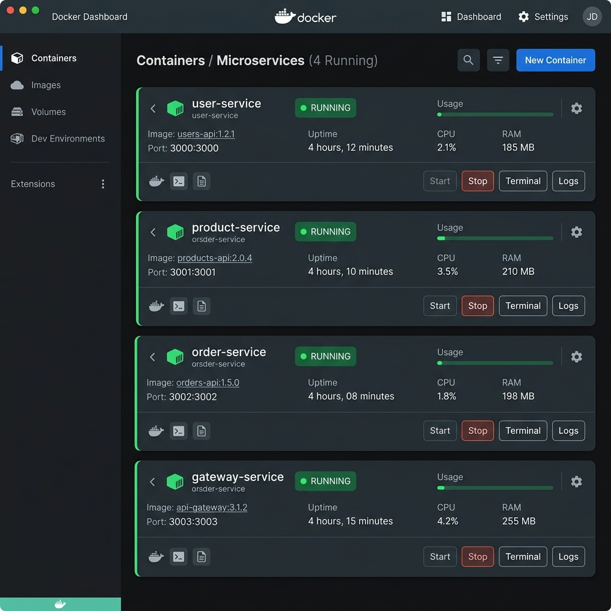

# Microservices Orchestration with Docker & Docker Compose

This submission contains the containerization and orchestration configuration for the Node.js microservices:
1. **User Service** (Port 3000)
2. **Product Service** (Port 3001)
3. **Order Service** (Port 3002)
4. **Gateway Service** (Port 3003)

---

## Architecture & Containerization
Each service is containerized using a lightweight `node:18-alpine` base image. A shared Docker bridge network (`microservices-net`) enables the services to resolve each other securely via their container/service names.

---

## Setup & Run Instructions

### Prerequisites
- Docker installed on your host machine.
- Docker Compose installed.

### Steps to Run
1. Navigate to the root directory (where `docker-compose.yml` is located).
2. Run the following command to build the Docker images and start the services:
   ```bash
   docker-compose up -d --build
   ```
3. Verify that all 4 containers are running by running:
   ```bash
   docker ps
   ```

---

## How to Test Each Service

You can test the services individually or through the Unified Gateway Service using `curl` or any web browser:

### 1. Directly via Service Ports
* **User Service:**
  ```bash
  curl http://localhost:3000/users
  ```
* **Product Service:**
  ```bash
  curl http://localhost:3001/products
  ```
* **Order Service:**
  - Get orders:
    ```bash
    curl http://localhost:3002/orders
    ```
  - Create an order:
    ```bash
    curl -X POST -H "Content-Type: application/json" -d '{"userId": 1, "productId": 2}' http://localhost:3002/orders
    ```

### 2. Through the Gateway Service (Unified Entry Point)
* **Users endpoint:**
  ```bash
  curl http://localhost:3003/api/users
  ```
* **Products endpoint:**
  ```bash
  curl http://localhost:3003/api/products
  ```
* **Orders endpoints:**
  - Get all orders:
    ```bash
    curl http://localhost:3003/api/orders
    ```
  - Create a new order:
    ```bash
    curl -X POST -H "Content-Type: application/json" -d '{"userId": 1, "productId": 101}' http://localhost:3003/api/orders
    ```

---

## Screenshots
Below is a screenshot of the orchestrated services running in Docker:



---

## Basic Troubleshooting Tips

1. **Port Conflicts**:
   - *Issue*: Port 3000, 3001, 3002, or 3003 is already in use by another process.
   - *Fix*: Stop the local processes using these ports or modify the host port mappings in `docker-compose.yml`.

2. **Network/Host Resolution Failures**:
   - *Issue*: Gateway service cannot reach backend services.
   - *Fix*: Ensure all containers are running on the same network (`microservices-net`) and that you used `docker-compose up` to start them together.

3. **Rebuilding Clean Images**:
   - *Issue*: Code changes are not reflected in running containers.
   - *Fix*: Force a rebuild of the Docker images:
     ```bash
     docker-compose down
     docker-compose up --build
     ```
